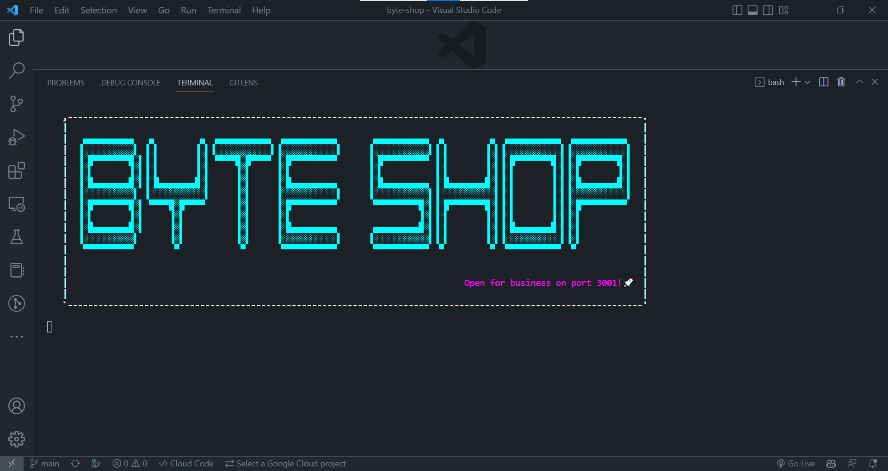

# byte-shop

## Description

This is the backend of an e-commerce website. It uses sequelize to create a database and connect it to the server. It also uses express to create the server and routes. It uses dotenv to hide the database credentials.

## Usage

After cloning the repo, run npm i to install the dependencies. Then after creating the database, run npm run seed to seed the database. Then run npm start to start the server.

## Link to Video Walkthrough

[Video Walkthrough]()

## Screenshot

## Testing

Testing has not been implemented yet.

## License

Mit License

## Contributing

If you would like to contribute to this project, please contact me at the email below.

## Questions

If you have any questions about the repo, open an issue or contact me directly at [phosphorescence3@hotmail.com](mailto:phosphorescence3@hotmail.com). You can find more of my work at [lesley-byte](https://github.com/lesley-byte) on github.

## Credits

I would like to thank my tutor, my TA, my Instructor and my classmates for their help and support.
